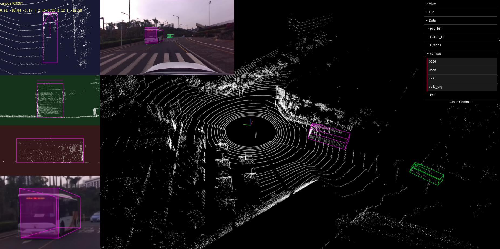

# point cloud 3D bounding box annotation tool




## requirements

python2, cherrypy


## start
python main.py


## data preparation

````
public
   +- data
       +- scene1
             +- image
                  +- 0000.jpg
                  +- 0001.jpg
             +- pcd
                  +- 0000.pcd
                  +- 0001.pcd
             +- bbox.json
                  +- 0000.bbox.json
             +- calib.txt
       +- scene2
             
````

bbox.json is the directory to save the annotation result.

calib.txt is the calibration matrix from point cloud to image. it's optional, but if provided, the box is projected on the image so as to assist the annotation.

